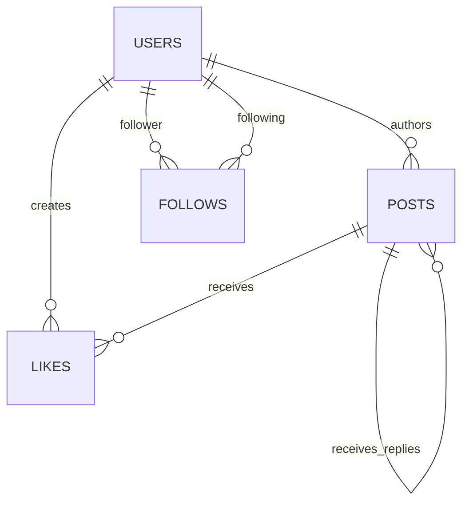

# Pulse Veritabanı Modeli

## 1. Amaç

Bu doküman güncel Pulse MVP için PostgreSQL veri modelini tanımlar.

Model aşağıdaki dokümanlarla uyumludur:

- `docs/architecture.md`
- `docs/api-contract.md`

## 2. Genel kurallar

- Veritabanı: PostgreSQL
- ORM: Entity Framework Core
- Birincil kimlikler: integer identity
- Tarih-zaman: UTC `timestamp with time zone`
- Tablo ve sütun isimleri: snake_case
- JSON alanları: camelCase
- Şifreler düz metin saklanmaz.
- Kullanıcı sahipliği JWT `sub` claim'inden belirlenir.
- Gönderi metni veritabanında `content` sütununda saklanır.
- `description`, `title`, `text` veya `body` gönderi sütunu olarak kullanılmaz.

## 3. Güncel MVP tabloları

Güncel MVP aşağıdaki tabloları gerektirir:

- `users`
- `posts`
- `follows`
- `likes`

Arama, bildirim, bookmark, repost, block, report ve medya tabloları güncel MVP için zorunlu değildir.

## 4. İlişki diyagramı



5. users

5.1 Sütunlar

SütunPostgreSQL türüNullKural
idintegerHayırPrimary key, identity
usernamevarchar(30)HayırBenzersiz
normalized_usernamevarchar(30)HayırKüçük harf, benzersiz
emailvarchar(320)HayırBenzersiz
normalized_emailvarchar(320)HayırKüçük harf, benzersiz
password_hashtextHayırBCrypt hash
display_namevarchar(80)HayırTrim sonrası boş olamaz
biovarchar(160)EvetTrimlenmiş
avatar_urltextEvetURL
is_activebooleanHayırVarsayılan true
created_attimestamptzHayırUTC
updated_attimestamptzEvetUTC

5.2 İndeksler

Unique index: normalized_username

Unique index: normalized_email

Index: (is_active, created_at desc)

5.3 Kurallar

Kullanıcı adı karşılaştırmaları normalize edilmiş alan üzerinden yapılır.

E-posta karşılaştırmaları normalize edilmiş alan üzerinden yapılır.

Password hash dışında şifre verisi saklanmaz.

Kullanıcı kendi kimliğini request body ile belirleyemez.

6. posts

6.1 Sütunlar

SütunPostgreSQL türüNullKural
idintegerHayırPrimary key, identity
author_idintegerHayırFK → users.id
contentvarchar(280)HayırTrim sonrası 1–280 karakter
parent_post_idintegerEvetSelf FK → posts.id
created_attimestamptzHayırUTC
deleted_attimestamptzEvetSoft delete

6.2 İndeksler

Index: (created_at desc, id desc)

Index: (author_id, created_at desc, id desc)

Index: (parent_post_id, created_at asc, id asc)

Partial index: deleted_at IS NULL

6.3 Kurallar

content null olamaz.

content trim sonrası boş olamaz.

content en fazla 280 karakterdir.

author_id request body üzerinden alınmaz.

Ana gönderide parent_post_id null olur.

Yanıtta parent_post_id üst gönderinin kimliğidir.

parent_post_id dolu olan bir gönderiye yanıt oluşturulamaz.

Bir gönderi yalnızca sahibi tarafından silinebilir.

Silme soft delete olarak uygulanabilir.

Soft delete edilmiş gönderiler feed sorgularında dönmez.

6.4 Tek seviyeli yanıt doğrulaması

Yeni yanıt oluşturulmadan önce üst gönderi okunur.

Aşağıdaki koşul sağlanmalıdır:

```
parent.parent_post_id IS NULL
```

Üst gönderinin parent_post_id değeri doluysa işlem reddedilir.

7. follows

7.1 Sütunlar

SütunPostgreSQL türüNullKural
follower_idintegerHayırFK → users.id
following_idintegerHayırFK → users.id
created_attimestamptzHayırUTC

7.2 Anahtar ve indeksler

Composite primary key: (follower_id, following_id)

Check constraint: follower_id <> following_id

Index: (following_id, created_at desc)

Index: (follower_id, created_at desc)

7.3 Kurallar

Kullanıcı kendisini takip edemez.

Aynı takip ilişkisi birden fazla kez oluşturulamaz.

Takip eden kullanıcı JWT sub claim'inden belirlenir.

Takip hedefi path'teki username üzerinden çözülür.

Request body içinde followerId veya followingId bulunmaz.

8. likes

8.1 Sütunlar

SütunPostgreSQL türüNullKural
user_idintegerHayırFK → users.id
post_idintegerHayırFK → posts.id
created_attimestamptzHayırUTC

8.2 Anahtar ve indeksler

Composite primary key: (user_id, post_id)

Index: (post_id, created_at desc)

Index: (user_id, created_at desc)

8.3 Kurallar

Aynı kullanıcı aynı gönderiyi birden fazla kez beğenemez.

Kullanıcı kimliği JWT sub claim'inden belirlenir.

Gönderi kimliği path'ten alınır.

Request body içinde userId veya postId bulunmaz.

9. Sayaç alanları

API aşağıdaki sayaçları döndürür:

postCount

followerCount

followingCount

likeCount

replyCount

İlk sürümde sayaçlar ilişkili tablolardan sorgu ile hesaplanabilir.

postCount

```
COUNT(posts.id)
WHERE posts.author_id = users.id
AND posts.deleted_at IS NULL
AND posts.parent_post_id IS NULL
```

followerCount

```
COUNT(follows.follower_id)
WHERE follows.following_id = users.id
```

followingCount

```
COUNT(follows.following_id)
WHERE follows.follower_id = users.id
```

likeCount

```
COUNT(likes.user_id)
WHERE likes.post_id = posts.id
```

replyCount

```
COUNT(child_posts.id)
WHERE child_posts.parent_post_id = posts.id
AND child_posts.deleted_at IS NULL
```

10. Feed sorgusu

Güncel feed kronolojik olarak sıralanır.

Temel sıralama:

```
created_at DESC, id DESC
```

Feed aşağıdaki kayıtları içerir:

Oturum sahibinin ana gönderileri

Oturum sahibinin takip ettiği kullanıcıların ana gönderileri

Feed aşağıdaki kayıtları içermez:

Soft delete edilmiş gönderiler

Yanıt gönderileri

Pasif kullanıcıların gönderileri

Örnek mantıksal filtre:

```
WHERE posts.deleted_at IS NULL
  AND posts.parent_post_id IS NULL
  AND (
    posts.author_id = @current_user_id
    OR posts.author_id IN (
      SELECT following_id
      FROM follows
      WHERE follower_id = @current_user_id
    )
  )
ORDER BY posts.created_at DESC, posts.id DESC
```

Feed sonucu yoksa boş liste döner. Veritabanında kayıt olmaması HTTP 404 üretmez.

11. Foreign key davranışları

İlişkiDavranış
posts.author_id → users.idRestrict
posts.parent_post_id → posts.idRestrict
follows.follower_id → users.idCascade
follows.following_id → users.idCascade
likes.user_id → users.idCascade
likes.post_id → posts.idCascade veya soft delete görünürlük filtresi

Kullanıcılar normal uygulama akışında fiziksel olarak silinmemeli, pasif hale getirilmelidir.

12. Transaction sınırları

Aşağıdaki işlemler transaction içinde yürütülmelidir:

Kullanıcı oluşturma

Gönderi oluşturma

Yanıt oluşturma

Follow oluşturma veya kaldırma

Like oluşturma veya kaldırma

Gönderi silme

İşlem başarısız olursa kısmi kayıt bırakılmaz.

13. Entity Framework Core eşleme kuralları

Tüm tablo ve sütun adları açıkça eşlenir.

Integer kimlikler identity olarak üretilir.

Composite primary key'ler Fluent API ile tanımlanır.

Maksimum uzunluklar hem validation hem schema seviyesinde korunur.

Tüm tarih değerleri UTC saklanır.

Soft delete kullanılıyorsa posts.deleted_at için global query filter uygulanır.

Username ve e-posta benzersizlikleri database index ile korunur.

14. Veri izolasyonu

Profil güncellemesi yalnızca JWT kullanıcısına uygulanır.

Gönderi silme sorgusu hem id hem author_id koşulu kullanır.

Like işlemlerinde kullanıcı request body'den alınmaz.

Follow işlemlerinde takip eden kullanıcı request body'den alınmaz.

Feed sorgusu oturum sahibinin kimliği ile sınırlandırılır.

15. Integration test kapsamı

Veritabanı ve API integration testleri en az aşağıdakileri doğrulamalıdır:

Username benzersizliği.

E-posta benzersizliği.

Gönderi içeriğinin 280 karakter sınırı.

Boş gönderinin reddedilmesi.

Gönderi kimliklerinin integer olması.

Kullanıcının kendisini takip edememesi.

Aynı follow ilişkisinin iki kez oluşturulamaması.

Aynı like ilişkisinin iki kez oluşturulamaması.

İkinci seviye yanıtın reddedilmesi.

Başka kullanıcı gönderisinin silinememesi.

Soft delete edilmiş gönderinin feed'de dönmemesi.

Veri bulunmayan feed sorgusunun boş liste üretmesi.

Sayaçların ilişkili kayıtlarla uyumlu olması.

Feed sıralamasının created_at DESC, id DESC olması.
